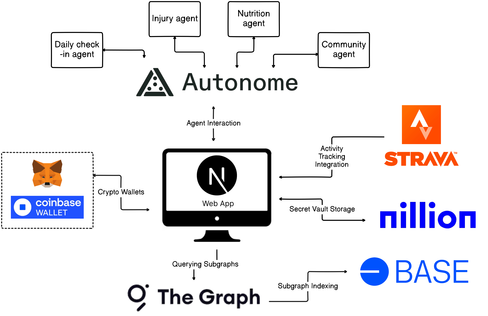

# athl3te

> A submission for the ETHGlobal Agentic Hackathon by Team Higgs
>
> [Live Demo](https://athl3te.vercel.app/)

## Overview

athl3te is a Web3-powered fitness application with AI-driven features that transforms how users track, manage, and improve their fitness journey through blockchain technology and AI assistance.

We're proud to be building with and applying for the following sponsor tracks:

- Autonome - AI Agent Ecosystem
- Base - Smart Contract Infrastructure
- Nillion - Secure Data Storage
- The Graph - Data Indexing & Queries

## System Architecture



## Core Features

### Activity Management

- Import activities from Web2 apps (Strava integration)
- Support for key activities: Walking, Running, Cycling, Swimming
- Personal workout logging and tracking
- Goal tracking system for sports and nutrition

### AI-Powered Assistance

- Daily check-in system with personalized AI agents
- Injury prevention and management
- Nutrition guidance and recommendations
- AI-managed community interactions
- Sentiment analysis and motivational support

### Community Features

- Activity-based community groups
- Real-time progress tracking
- Community challenges and goals
- AI-driven community management
- Achievement NFTs for milestones
- Automated health monitoring and tips
- Regular motivational updates
- Injury prevention insights

## Automated Systems

Our platform implements several automated processes to enhance user experience:

### Periodic Health Checks

- Regular community-wide injury pattern analysis
- Proactive injury prevention recommendations
- Automated recovery guidance for common injuries

### Community Engagement

- Scheduled motivational messages
- Regular fitness tips and best practices
- Activity trend analysis and insights
- Periodic achievement celebrations

## Technology Stack

### Base

- Smart contract deployment and management
- Secure transaction handling
- Web3 wallet integration (MetaMask and Coinbase Wallet)

### Autonome Implementation

We leverage Autonome for our AI agent ecosystem:

- Goal Setting Agent: Converts user inputs to structured JSON
- Personal Check-in Agent: Daily monitoring and guidance
- Injury Management Agent: Health monitoring and advice
- Nutrition Agent: Dietary recommendations
- Community Agents: Group management and engagement
- NFT Minting Agent: Achievement recognition

### The Graph Integration

Our subgraph indexes and queries:

- Real-time activity tracking
- Community goal progress
- Injury pattern analysis
- Community analytics and insights

### Nillion Secure Storage

Private data storage for:

- Personal goals and schedules
- Daily fitness plans
- Injury records
- Nutrition plans
- Activity progress
- Community memberships
- Agent subscriptions

## Premium Features

- Exclusive AI agents access
- Advanced nutrition guidance
- Performance analysis
- Achievement NFTs

## Installation & Setup

1. Clone the repository:
   ```sh
   git clone https://github.com/imApoorva36/athl3te.git
   ```
2. Navigate to the project directory:
   ```sh
   cd frontend
   ```
3. Install dependencies:
   ```sh
   npm install
   ```
4. Run the development server:
   ```sh
   npm run dev
   ```

## Contributing

We welcome contributions from the community! Feel free to fork the repo, open issues, and submit pull requests.

## License

This project is licensed under the Apache License.

---

### Join us in revolutionizing fitness with Web3 and AI!
